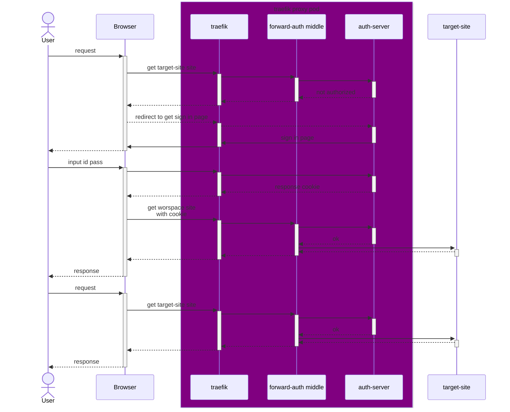
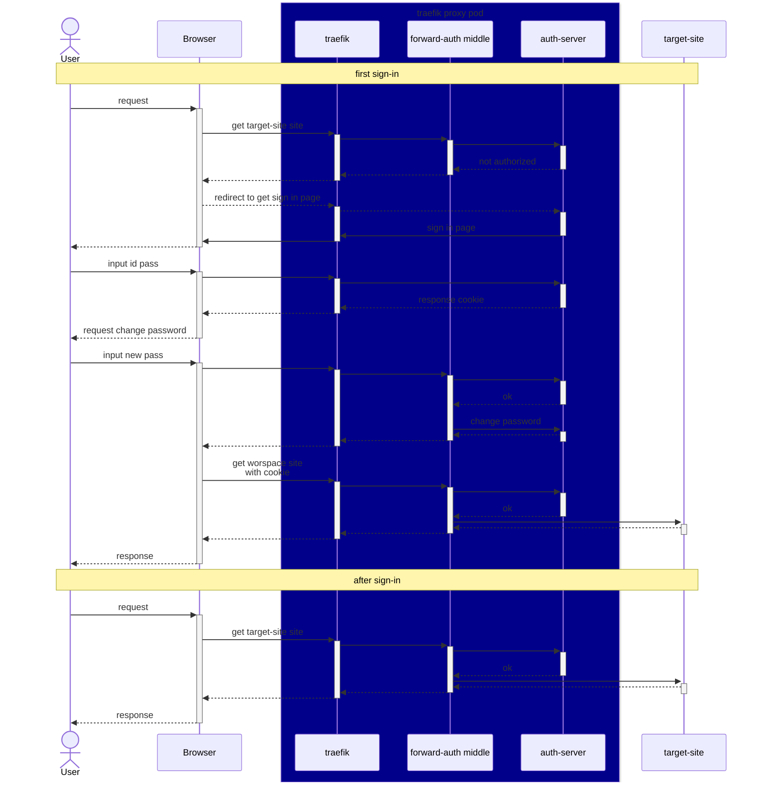

## Open target-site without Sign-in

```mermaid
sequenceDiagram
    actor User
    participant Browser
    box purple traefik proxy pod
        participant traefik
        participant forward-auth middle
        participant auth-server
    end
    participant target-site

    User ->> + Browser : request
        Browser ->> + traefik : get target-site site
            traefik ->> + forward-auth middle : 
                forward-auth middle ->> + auth-server : 
                auth-server -->> - forward-auth middle : not authorized
            forward-auth middle -->> -  traefik : 
        traefik -->> -  Browser : 
        Browser -->> + traefik :  redirect to get sign in page
            traefik -->> + auth-server : 
            auth-server ->> - traefik : sign in page
        traefik ->> - Browser : 
    Browser -->> - User : 

    User ->> + Browser : input id pass
        Browser ->> + traefik : 
            traefik ->> + auth-server : 
            auth-server -->> -  traefik : response cookie
        traefik -->> -  Browser : 
        Browser ->> + traefik : get worspace site<br/>with cookie
            traefik ->> + forward-auth middle : 
                forward-auth middle ->> + auth-server : 
                auth-server -->> - forward-auth middle : ok
                forward-auth middle ->> + target-site : 
                target-site -->> - forward-auth middle : 
            forward-auth middle -->> - traefik : 
        traefik -->> - Browser : 
    Browser -->> - User : response


    User ->> + Browser : request
        Browser ->> + traefik : get target-site site
            traefik ->> + forward-auth middle : 
                forward-auth middle ->> + auth-server : 
                auth-server -->> - forward-auth middle : ok
                forward-auth middle ->> + target-site : 
                target-site -->> - forward-auth middle : 
            forward-auth middle -->> - traefik : 
        traefik -->> - Browser : 
    Browser -->> - User : response
```

## Open target-site on first Sign-in

```mermaid
sequenceDiagram
    actor User
    participant Browser
    box darkblue traefik proxy pod
        participant traefik
        participant forward-auth middle
        participant auth-server
    end
    participant target-site

Note over User,target-site: first sign-in

    User ->> + Browser : request
        Browser ->> + traefik : get target-site site
            traefik ->> + forward-auth middle : 
                forward-auth middle ->> + auth-server : 
                auth-server -->> - forward-auth middle : not authorized
            forward-auth middle -->> -  traefik : 
        traefik -->> -  Browser : 
        Browser -->> + traefik :  redirect to get sign in page
            traefik -->> + auth-server : 
            auth-server ->> - traefik : sign in page
        traefik ->> - Browser : 
    Browser -->> - User : 

    User ->> + Browser : input id pass
        Browser ->> + traefik : 
            traefik ->> + auth-server : 
            auth-server -->> -  traefik : response cookie
        traefik -->> -  Browser : 
    Browser -->> - User : request change password

    User ->> + Browser : input new pass
        Browser ->> + traefik : 
            traefik ->> + forward-auth middle : 
                forward-auth middle ->> + auth-server : 
                auth-server -->> - forward-auth middle : ok  
                forward-auth middle ->> + auth-server : change password
                auth-server -->> - forward-auth middle :  
            forward-auth middle -->> - traefik : 
        traefik -->> -  Browser : 

        Browser ->> + traefik : get worspace site<br/>with cookie
            traefik ->> + forward-auth middle : 
                forward-auth middle ->> + auth-server : 
                auth-server -->> - forward-auth middle : ok
                forward-auth middle ->> + target-site : 
                target-site -->> - forward-auth middle : 
            forward-auth middle -->> - traefik : 
        traefik -->> - Browser : 
    Browser -->> - User : response

Note over User,target-site: after sign-in
    User ->> + Browser : request
        Browser ->> + traefik : get target-site site
            traefik ->> + forward-auth middle : 
                forward-auth middle ->> + auth-server : 
                auth-server -->> - forward-auth middle : ok
                forward-auth middle ->> + target-site : 
                target-site -->> - forward-auth middle : 
            forward-auth middle -->> - traefik : 
        traefik -->> - Browser : 
    Browser -->> - User : response
```

